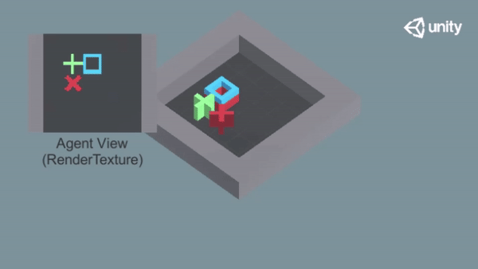
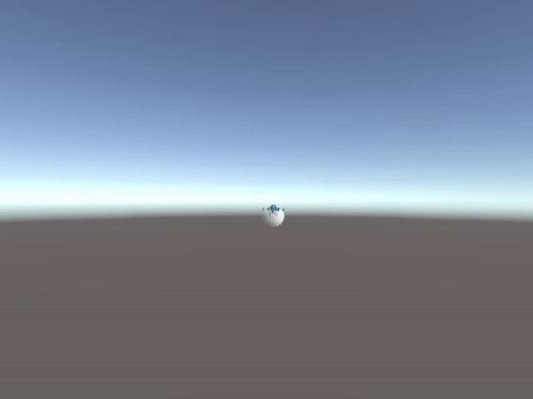
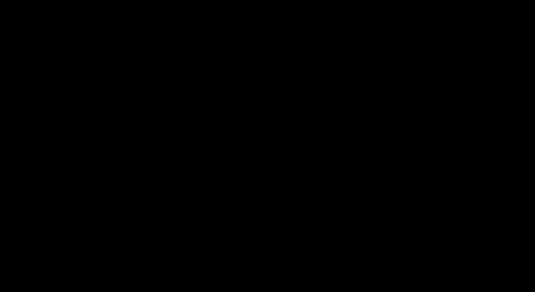

# Unity ML-Agents 2.0

이 레포지토리는 [Reinforcement Learning Korea](<https://www.facebook.com/groups/ReinforcementLearningKR/?ref=bookmarks>)의 유니티 머신러닝 에이전트 튜토리얼 제작 프로젝트의 결과로 제작된 강의들을 위한 자료들을 포함하고 있습니다. 본 레포에서는 다음의 강의에 대한 자료를 제공합니다. 

- [[인프런] 유니티 머신러닝 에이전트 완전 정복 (기초편)](https://inf.run/d2do)
- [[위키북스] 파이토치와 유니티 ML-Agents로 배우는 강화학습](https://wikibook.co.kr/pytorch-mlagents/)

이 레포는 본 강의에서 제작하는 유니티 ML-Agents([Github](<https://github.com/Unity-Technologies/ml-agents>)) 환경들의 빌드파일과 유니티 프로젝트 파일을 제공합니다. 또한 제공된 환경들에서 에이전트를 학습하기 위한 심층강화학습 알고리즘을 제공합니다. 

## 버전 정보
강의를 진행할때 사용한 소프트웨어들의 버전이 약간 오래된 버전인 관계로 비교적 최신 소프트웨어들로 호환성을 확인했습니다!<br> 
아래 "강의 진행 버전"과 "호환성 확인 버전" 중 어떤 설정으로 진행하셔도 강의 내용을 진행하실 수 있습니다. 
### 강의 진행 버전
- Python 3.8
- Pytorch 2.0
- Unity 2021.1.18 
- ML-Agents 2.0 (Unity Package)
- ML-Agents 0.26.0 (Python Package)
### 호환성 확인 버전
- Python 3.8
- Pytorch 2.1
- Unity 2022.3.4 
- ML-Agents 3.0 (Unity Package)
- ML-Agents 1.0.0 (Python Package)

## 사용법 
```cmd
pip install -r requirements.txt
cd agents
python **.AGENT.py # 예시: python 04.dqn.py
```

## 디렉토리 구조 설명
```
├─ agents           # 에이전트 학습 스크립트 관리
├─ config           # ml-agents 내장 알고리즘 config.yaml 관리
├─ demo             # demonstration 관리
├─ envs             # 빌드된 환경 관리
├─ resrc            # README 이미지 관리
└─ unity_project    # 환경의 유니티 프로젝트 관리
```

## 알고리즘 
모든 알고리즘은 파이썬과 [파이토치](https://pytorch.org/)를 통해 작성되었습니다. 본 강의에서 제공하는 심층강화학습 알고리즘은 다음과 같습니다. 

### 기초편 
1. [Deep Q Network (DQN)](https://www.nature.com/articles/nature14236)
2. [Advantage Actor Critic (A2C)](https://proceedings.neurips.cc/paper/1999/file/464d828b85b0bed98e80ade0a5c43b0f-Paper.pdf)
3. [Deep Deterministic Policy Gradient (DDPG)](https://arxiv.org/pdf/1509.02971.pdf)
4. Behavioral Cloning (BC)

### 응용편
1. [Proximal Policy Optimization (PPO)](https://arxiv.org/pdf/1707.06347.pdf) 
2. Attention PPO
3. Adversarial PPO
4. [MA-POCA](https://rlg.mlanctot.info/papers/AAAI22-RLG_paper_32.pdf) 
5. [Exploration by RND](https://arxiv.org/pdf/1810.12894.pdf)
6. [HyperNetworks](https://arxiv.org/pdf/1609.09106.pdf)

## 환경 
모든 환경은 유니티와 유니티 머신러닝 에이전트를 통해 제작되었습니다. 다음과 같은 환경들의 제작 방법에 대해 강의합니다. 각 환경과 해당 환경에 대한 학습 결과는 다음과 같습니다. 

### 기초편

**1. 그리드월드** <br> 


**2. 드론** <br> 


**3. 카트 레이싱** <br> 


### 응용편 
**1. 닷지** <br> 


**2. 퐁** <br> 


**3. 방탈출** <br> 


**4. 메이즈** <br> 


**5. 투 미션** <br> 

